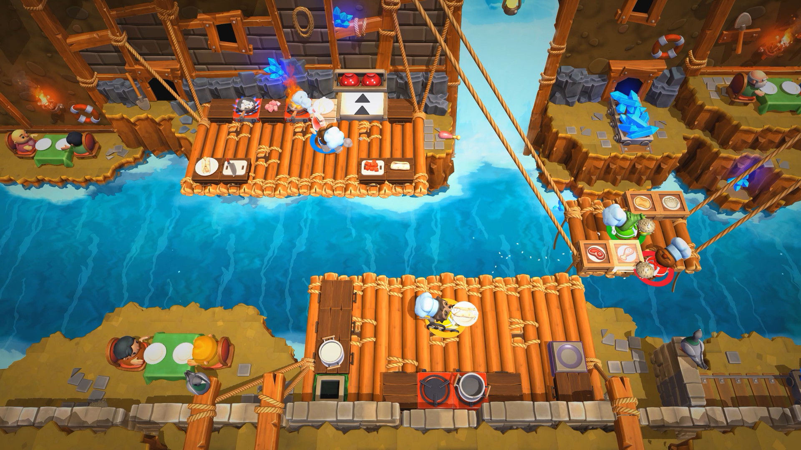
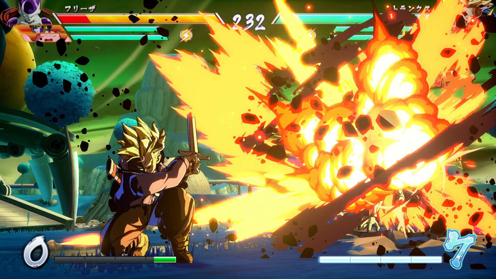
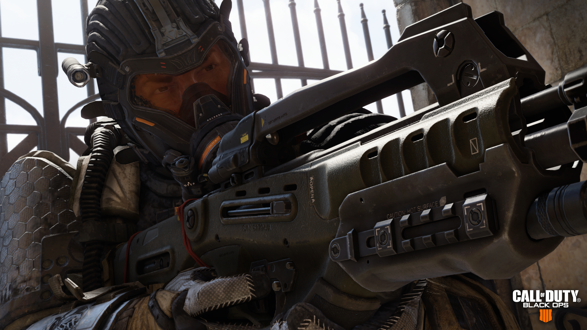
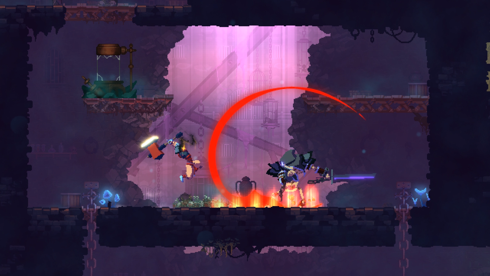
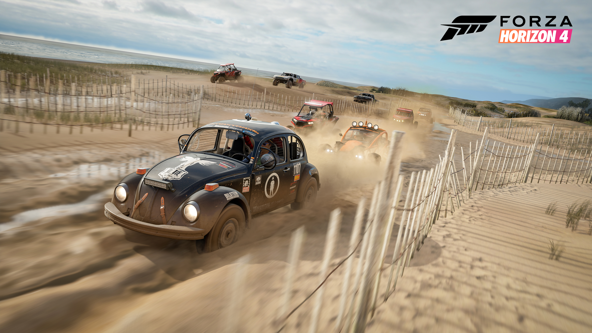
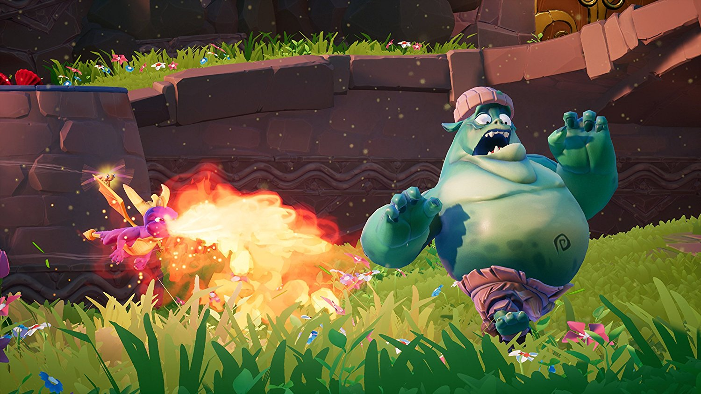
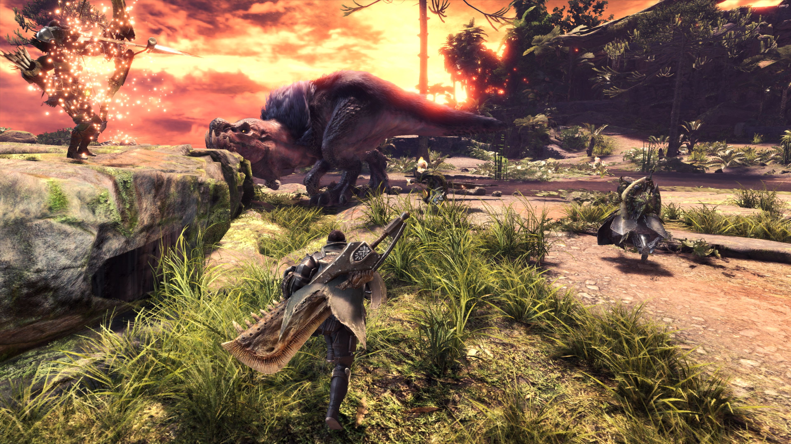
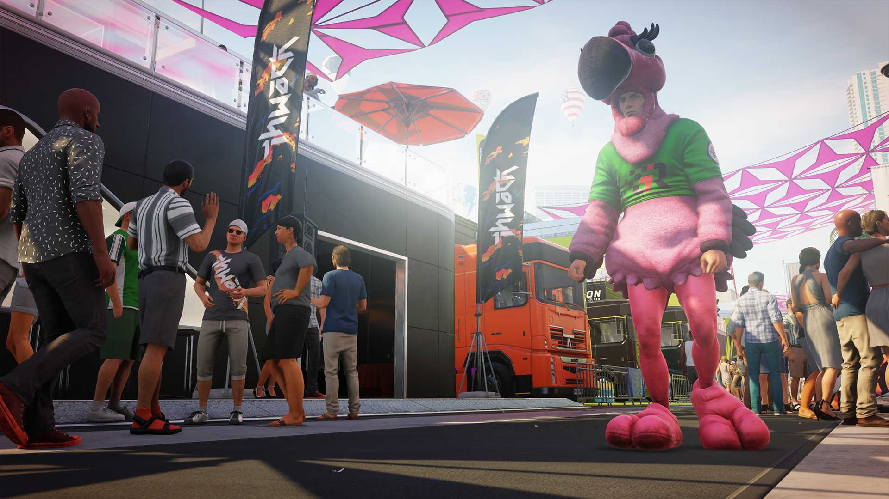
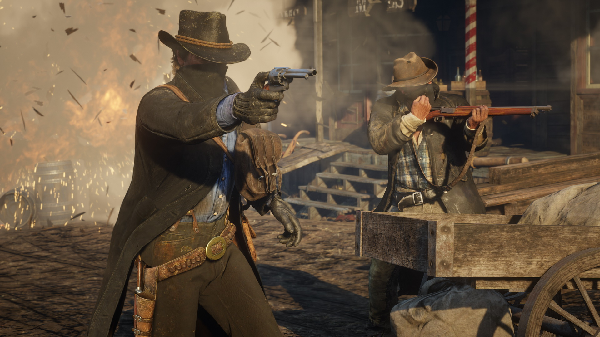
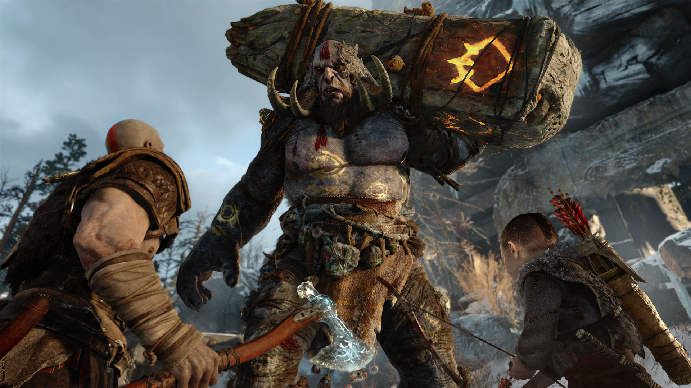

As I look back at the games that were released in 2018, I am once again amazed by the number of quality titles the industry has been putting out on a consistent basis. While this year also had it's share of disappointing garbage, I feel confident saying that there has never been a better time to be playing video games. The fall season was especially jam packed, and I'm still catching up on a few games which may or may not supersede the ones on this list. However, I feel that each of these choices are truly fantastic games in their own right and are deserving of recognition as some of the best games of 2018.

### 10. Overcooked 2

Overcooked 2 is the first of several sequels that make appearances on this list. The original Overcooked is one of the best co-op games that I’ve ever played on PC, but when Overcooked 2 was announced for Switch, I knew immediately which platform I’d be picking it up on. The joy-con controllers work great for this game. The levels are just as challenging (and infuriating) as always, but controlling your chef still feels responsive and intuitive. The new ingredient throwing mechanic adds a fun new wrinkle to the already excellent formula, and some levels require you to use the ability to it’s fullest potential in order to succeed. While Overcooked 2 is an iterative improvement on the first game,  the base recipe of these games remains as fun as ever.

### 9. Dragon Ball FighterZ

I’ve never been one to play too many fighting games due to the unfortunate fact that I’m completely terrible at them. However, I was forced to make an exception this year for Dragon Ball FighterZ after playing a few fights at a friend’s house. First, the art style of this game blew me away. The characters all look fantastic, and the screen radiates with gorgeous, colorful beams and explosions as the players duke it out across classic Dragon Ball settings. I really enjoy how unique each character plays with different movesets and super attacks. Playing this game is what I imagine being a Super Saiyan feels like – blindingly fast and powerful, with an array of explosive abilities to absolutely decimate your opponents.

### 8. Call of Duty: Black Ops 4

I’m part of a minority in the gaming community who still buys Call of Duty every single year. While I definitely haven’t enjoyed all of them, I’m usually able to spend a decent amount of time with the games since it’s easy to hop into multiplayer matches. I was definitely concerned about this year’s title after it was announced there would be no campaign. However, the multiplayer and Blackout modes in Black Ops 4 more than make up for the lack of single player story. The classic multiplayer mode brings back the specialist system from Black Ops III, which still brings enough variety to the fights to make things interesting. The movement and shooting still feel excellent, and the new “press button to heal” mechanic removes the need to sit around and wait to regain health. In my opinion, this makes the combat feel more fluid than every other game in the franchise. The Blackout mode was also a welcome surprise after seeing so many half-baked battle royale games barfed out onto the Steam marketplace. The developers have done a great job at mixing the battle royale formula with classic Call of Duty gameplay in a smooth and polished new game mode.

### 7. Dead Cells

Dead Cells might just be the best-feeling 2D side scroller game that I've ever played. From smashing through doors to hacking apart enemies, the combat feels fast and impactful even in the beginning levels when you have limited weaponry.  I enjoy the amount of variety that the game provides through the branching level paths and various build types. The perks and weaponry let you try out multiple setups and tailor your character's abilities to your own playstyle. My ideal setup consisted of any bow that could freeze enemies and turrets that could whittle their health down as I jumped in and out of combat with fast weapons. The game also does the "pixel art" style well without looking too derivative or simple, and each environment that you battle through looks gorgeous and unique.

### 6. Forza Horizon 4

With the complete dearth of good arcade racers these days, I am so happy that the Forza Horizon series is still receiving plenty of publisher support. The sheer number of cars is incredible and gives me the chance to drive all the stuff I'll never be able to afford. One of my favorite ways to chill out after work is to just pick one of my favorite cars and drive around the map. The open world of the U.K. offers the hallmarks of all great free roam racers: beautiful scenery, twisting roads, and fantastic stunt jumps. Whether it's drifting down a twisty mountain switchback, blasting through the dirt roads in the middle of the forest, or drag racing across the beach at sunset, I enjoyed every minute of my time in Horizon 4 and can't wait to play more.

### 5. Spyro Reignited Trilogy

When the news of the Crash Bandicoot remake was announced, I immediately hoped that Spyro remakes would soon follow. The original three Spyro games are absolute classics in the 3D platformer genre and were some of the first games I ever 100% completed. The Spyro Reignited Trilogy remains faithful to the gameplay of the originals but upgrades the world of Spyro with gorgeous new visuals and a remastered soundtrack. This game came at a great time for me after I had started to get bogged down in the length and seriousness of some other games I had been playing. Spyro offers a breath of fresh air with it's goofy characters and simple, fun gameplay that still holds up in 2018. I have no doubt that I will once again 100% these games as I relive some of my most nostalgic gaming moments from when I was a kid.

### 4. Monster Hunter: World

I never had the pleasure of playing Monster Hunter before since I refused to play this kind of game on a tiny handheld screen. Monster Hunter: World brought the series to PS4 for the first time, and I immediately dove in headfirst after enjoying my time in the beta. Each zone contains beautiful scenery and it's own group of fearsome monsters which the player is tasked with killing. The gigantic, brutal-looking weapons are some of the best I've ever seen in a video game. The combat feels weighty and deliberate in a way that makes each successful attack seem absolutely devastating. The ever-increasing difficulty challenged me in a meaningful way as I developed my skills and continued to improve my hunting prowess. While I was eventually pulled away by other games, the memories of tracking and slaying the epic beasts of Monster Hunter: World will stay with me for a long time.

### 3. Hitman 2

The most common description of Hitman 2 that I have seen from reviewers is that it's "more Hitman". However, a continuation of the first game is exactly what I was hoping for with Hitman 2. The levels are even bigger this time around and full of the cool locations and secret passages that the first game was known for. The open, sandbox-y nature of the environments encouraged me to experiment with disguises and weapons to stumble upon new hilarious ways of eliminating my targets. Agent 47 approaches each situation with his typical deadpan personality, which only further highlights the comical soup-can knockouts and goofy conversations dressed as a flamingo mascot. I replayed the levels multiple times to try and find different ways of killing people, which involved sniping from a racetrack announcers' booth and feeding a man to his own pet hippo. IO Interactive also made sure to add new mechanics such as the briefcase and working mirrors to keep the formula fresh, and even "remastered" the first Hitman levels to take advantage of the new abilities. I'm looking forward to my continued replaying of the existing levels and the new experiences to come in the post-launch support.

### 2. Red Dead Redemption 2

There are very few characters in the history of video games that have stuck with me as much as Arthur Morgan. His transformation from violent, scheming desperado to broken, vulnerable hero is explored with the interesting and genuine storytelling that Rockstar has always been known for. The side quests received the same excellent writing that was present in the main plot and were full of memorable characters and encounters. The slow pace and vibrant living world allowed me to get fully immersed in the lifestyle of a cowboy as I shot and robbed my way through the dying Wild West. The vast scope and attention to detail was at times overwhelming but I never felt like it detracted from the experience. In between the movie-like action sequences, I spent plenty of time obsessing over the length of my beard, ensuring I was taking enough baths, and tailoring Arthur's outfits to match his current activities in the story. I sought out conversations on fishing trips with the other members of the gang to learn more about their histories, and spent time chopping wood and listening to stories around the campfire.  Very few other games have allowed me to play a role in such a satisfying way. From the slow, methodical gameplay to the epic soundtrack, Rockstar cultivated every aspect of Red Dead Redemption 2's presentation to create an awesome and remarkably consistent experience from beginning to end.

### 1. God of War

In an industry where lootboxes, microtransactions, and half-finished games are becoming more and more prevalent, I am so glad to see single player experiences like God of War continue to be developed and released with widespread critical and commercial success. By some unfortunate circumstance, I had never played a God of War game before this, and as a result wasn’t following this game’s development until I saw a gameplay trailer a few months before it’s release. It was obviously a departure from the older games and the boomerang axe looked pretty fun, so I picked up the game on release day after reading the rave reviews from games journalists. What I found was one of the most fun, engrossing, and polished games that I have ever had the pleasure of playing. God of War’s combat, while simplistic at first, soon opens up with a variety of moves and axe powers that are fun to use and demonstrate the immense power of Kratos. It’s incredibly satisfying to be in the middle of a group of enemies, throw your axe to freeze one of them, and then yank it back through 2 or 3 other enemies and follow up with a leaping smash of frozen magic that destroys everyone in front of you. Atreus provided a great way to help the player with a few fun abilities while never being annoying to babysit. The boss fights (especially the fights with Baldur) provided a cinematic spectacle I’ve rarely seen in other games. The story of Kratos and Atreus’s journey to the top of the mountain adapts the Norse source material in clever ways and is surprisingly heartfelt. Bolstered by beautiful environments and an epic, moving score, God of War is a high-water mark for video games as an art form, and should not be missed under any circumstances.