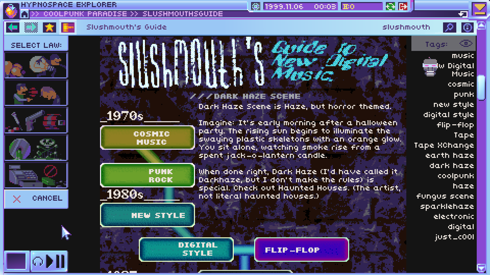
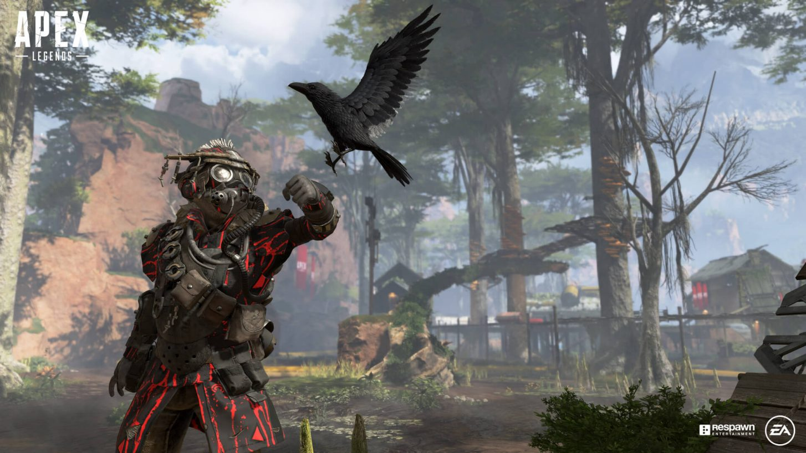
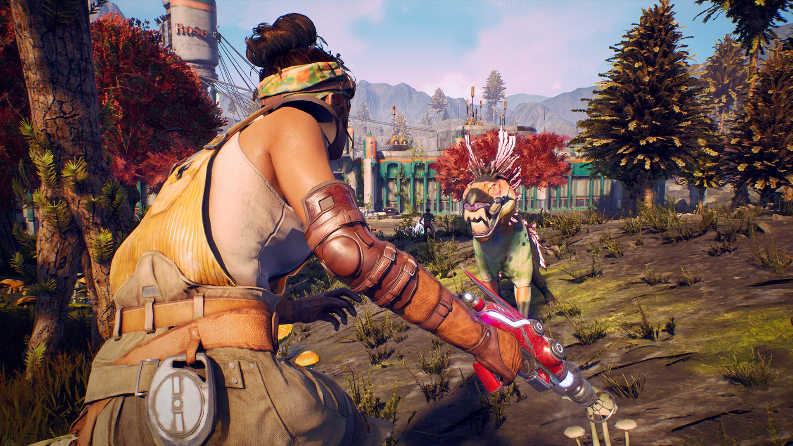
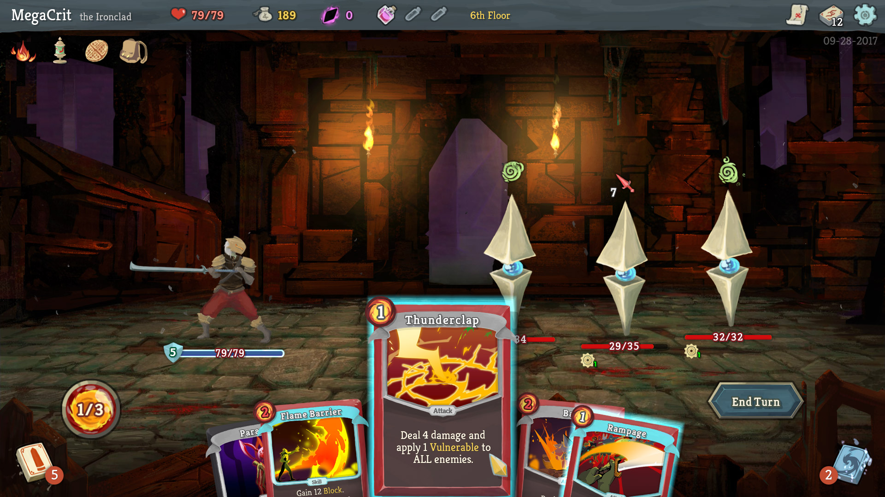
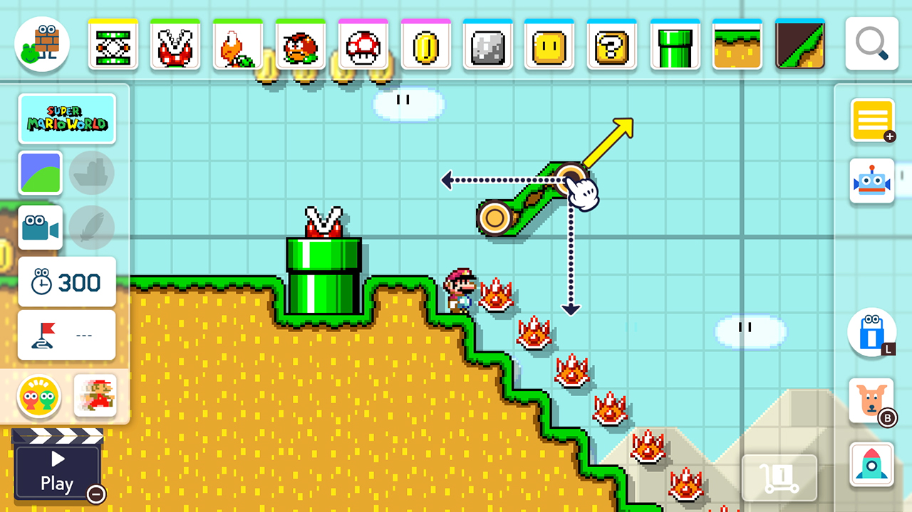
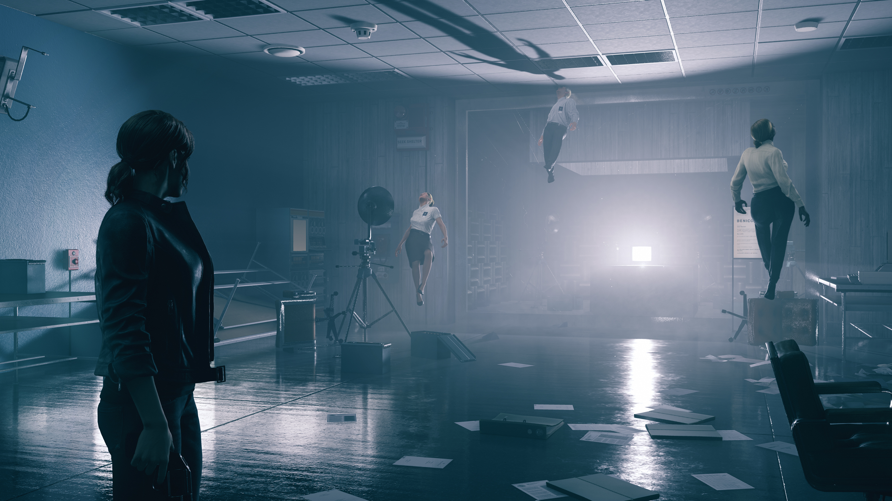
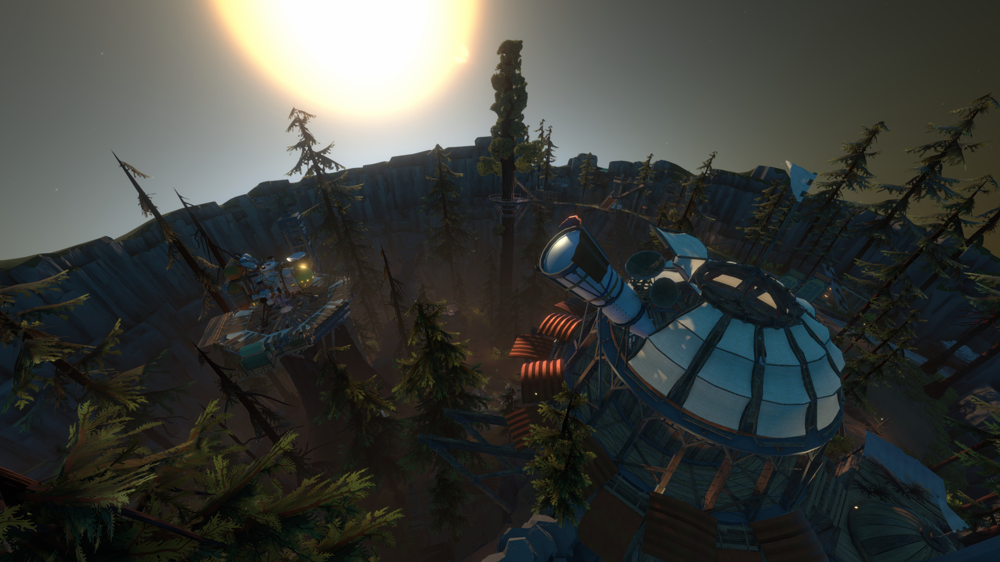
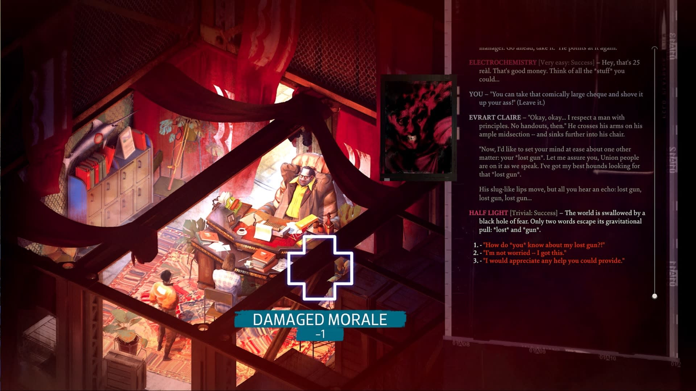

I'm always glad to be surprised by new games. As someone who usually keeps a close eye on gaming news through social media and podcasts, I sometimes miss the feeling of finding a game that I haven't heard of before and playing it for the first time. So many of my favorite games this year either flew under my personal radar or released unexpectedly, and it was fun to jump into them without any prior expectations.

### 10. Hypnospace Outlaw

I honestly think I'm a little too young to truly appreciate the kind of nostalgia that Hypnospace Outlaw is going for, but I've seen enough of the "old internet" that I can at least appreciate what they are trying to do. This game oozes style in a way very few games do, starting with the idea of playing inside a fake operating system that looks like an early Macintosh desktop on acid. It's fun to navigate the Hypnospace sites to solve the puzzles the game puts in front of you, but it's even more amusiing to see all the easter eggs and hidden content that the developers added for players to find. There's lots of interesting wordbuilding and side stories that happen outside of the main narrative, which is excellent in its own right. The story especially resonated with me as a software developer who has seen the tech industry evolve into the ethically ambiguous mess that it is today.

### 9. Call of Duty: Modern Warfare

Honestly, I think this game is the Call of Duty that people have been waiting for. I am admittedly a sucker for these games regardless of their quality, but Call of Duty: Modern Warfare feels like it found heights that the series hasn't reached since *maybe* Modern Warfare 2 or Black Ops 1. The campaign missions were mostly well-executed and had a few new ideas such as the night vision sequences that kept me interested in playing. The story I found to be hit-or-miss, with issues like the notable ["Highway of Death" controversy](https://www.polygon.com/2019/10/30/20938550/call-of-duty-modern-warfare-highway-of-death-controversy) detracting from the experience. However, I think the game particularly shines in the multiplayer, which kept me engaged for far longer than the past few games in the series. The guns all feel great to use, the attachment system is deep, and I found the overall map rotation to be pretty solid (no doubt helped out by the inclusion of several legacy maps from previous games). In addition, there was also no season pass for this game, which kept the playerbase on the same page with respect to the maps they had available to play. Activision also added crossplay this time around, which will no doubt make it easy to find games for a much longer period of time. I just wish they'd keep updating this game instead of churning out a new one next year.

### 8. Apex Legends

Remember when I talked about games releasing unexpectedly? Apex Legends truly came out of nowhere when Respawn Entertainment dropped their take on a battle royale with only a few rumors coming before release day. It really comes as no surprise that the people who made stuff like Titanfall 2 created such an impressive new shooter. Thankfully, I think Apex Legends (bad name, by the way) will stick around far longer than either of the Titanfall games did. The movement feel is the best in the genre, and the character abilities made it fun to find new team compositions to handle different in-game situations. I also have a weird appreciation for the forced teamwork that Respawn has committed to, and they made sure to add an innovative pinging system that makes the game much easier to play with randos. Like most battle royale games, I'll be interested to see how the live servics model plays out, but I expect to be playing a lot more of this game over the next few years.

### 7. The Outer Worlds

The Outer Worlds is a perfectly acceptable (if short) RPG that I had been keeping tabs on since Obsidian first teased it. People have been clamoring for another Fallout: New Vegas for years, and many were hopeful that this game would fit the bill. While it doesn't live up to those incredibly high expectations, it's still a great way to spend 30ish hours. The story had some interesting moral choices that had me questioning the "correct" decision, and the characters  had a ton of personality. The highlight for me was the companion Parvati and her respective questline. Her writing and voice acting were treated with a level of care that few NPCs receive. The quality of the story and environments definitely tailed off towards the end of the game, but the dystopian corpo-space setting kept me interested enough to see how the main questline and companion missions were resolved.

### 6. Ace Combat 7: Skies Unknown

I have been championing Ace Combat to anyone who would listen for years to no avail, and desparately hoping that another game in the main series would finally get made. This year, I fiinally got my wish. Ace Combat 7 does a pretty good job of living up to its predecessors and has no shortage of intense dogfights, epic orchestral music, and dramatic anime cutscenes. The mission types are reasonably varied with plenty of dogfighting, bombing runs, and stealth missions. The story comes with a generous dose of Ace Combat cheesiness but serves as a good way for the game to introduce all the nonsensical aircraft and weaponry that the series has always been known for. Massive drone ship that spawns tons of tiny attack drones to destroy your allies? Yup. Gigantic cannons originally used to shoot asteroids out of the sky? Sure. The story also ties back into previous games, which is always fun for veterans of the series. I haven't tried the multiplayer or VR modes yet, but a new campaign was really all I needed.

### 5. Slay the Spire

Slay the Spire is a dangerous game. It has turned many of my nights into sleepless grinds through dungeons as I endlessly search for another successful run. The cards and abilities feel powerful enough that I never feel like I've wasted my time, even on a "bad run". The game does a great job of pushing you to try different synergies by the size of the card and item pools, which keep runs feeling fresh. It's a great feeling when you finally manage to pull together a super overpowered strategy and just steamroll over the minions and bosses. The different champions each have different types of cards so you can change up the experience when you get bored with one of them. So far my main criticism has been the platforms the game released on. PLEASE RELEASE THIS ON ANDROID SO I CAN LOSE MORE TIME!

### 4. Mario Maker 2

Like most people, I never had a Wii U and I never got to play the first Mario Maker. By several accounts this game is just More of That, but as someone who is new to the series, I think it's pretty incredible. I had an absolute blast with both the creation tools and the level browser. I was blown away with all the innovative uses people find for the different objects, and the toolset makes it so easy to create a level that's actually halfway decent. My favorite level to create was one based around finding new ways to kill Yoshi. I'll never be as skilled as some people's stages demand, but the curation tools did a pretty good job of finding levels that matched my mediocre ability. I can't wait to see what new items and tools Nintendo has in store for the game. 

### 3. Control

Finally, a game for all the SCP Foundation fans out there! Control is a game that succeeds because of the excellent worldbuilding rather than the explicit storytelling. Each room of the Oldest House contains files and recordings describing "Altered World Events", which are cases where supernatural beings or objects invade reality and warp or change things around them. The cases are similar to internet creepypasta stories, with incomplete accounts of the events that occurred and more redacted sections then your average FBI "declassified" documents. The game takes plenty of time to work many of the "Altered" items into the main story and gives you fun gameplay mechanics as a reward. Jesse's combat abilities are constantly evolving, and the game does a great job at feeding you power upgrades so you don't get bored. I did struggle with some frustrating difficulty spikes when fighting certain bosses, but they didn't take too much away from my overall enjoyment of the game.

### 2. Outer Wilds

The top two games on my list are both masterpieces. That's not a term I use lightly: I truly think that they will both be highly regarded for years into the future. It was extremely difficult for me to rank one of them above the other, so I'll think of them more as 1a) and 1b).

The Outer Wilds is a brilliant space journey about exploration, wonder, and loss. I refuse to say too much about this game out of an abundance of caution for anyone who hasn't played it, but I really hope that anyone who's at least slightly interested in space travel, science, or just plain old good games makes the time to place this game. The different planets are beautiful and varied in their environments. The in-game physics and space phonemena are awe-inspiring in the ways the player can interact with them. The discoveries you make in the game are amazing, sad, even horrifying - but each and every one gives an incredible feeling of pioneering that keeps you engaged. Finally, the story resolves with an extremely satisfying ending that will stick with me for a long time. I just wish I could forget everything and start over from the beginning

### 1. Disco Elysium

Video games as a medium often suffer from relatively poor writing and direction, especially when compared to art forms like books or movies. Games are both extremely expensive and very time-consuming to make, and publishers often need to appease their shareholders with only a few releases each year. This leads to releasing games with stories that focus on mass-market appeal and gameplay as a higher priority. Disco Elysium is one of the few games I've played that felt like it had truly great writers involved in the development process. The game plays like an old CRPG, except without any "real" combat. Instead, the entire game revolves around making choices and skill checks to determine the flow of the narrative, and there is an absolutely incredible amount of dialogue to read. Not only is there dialogue between the characters of the game, but the main character's various skills and thoughts chime in with their takes on specific situations that you encounter while playing. Leveling these skills allows you to interact successfully with the different people in the world, and I love that there are multiple ways to approach a problem (or avoid the it entirely). The shattered mind of your detective poses such an interesting array of possible personality traits, and they all add interesting and hilarious flavor to dialogues. This is a game that puts roleplaying above any gameplay mechanic, and because of that, it's one of the best RPGs I've ever played.