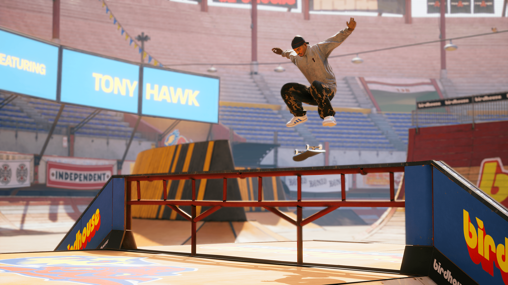
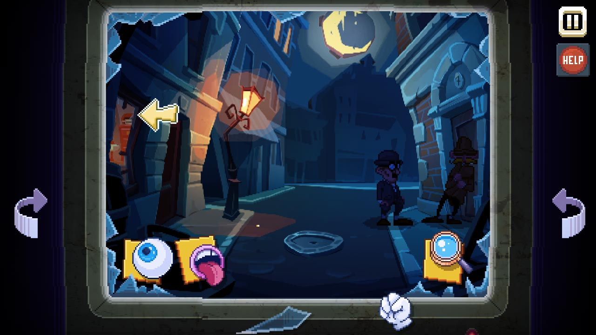
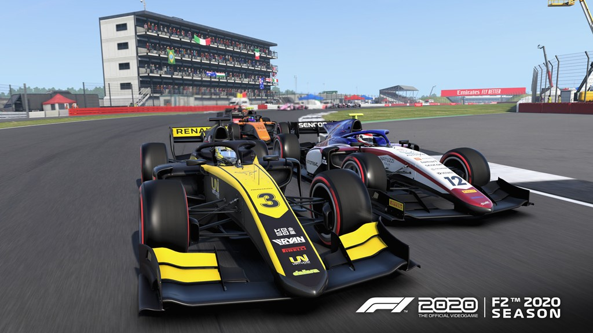
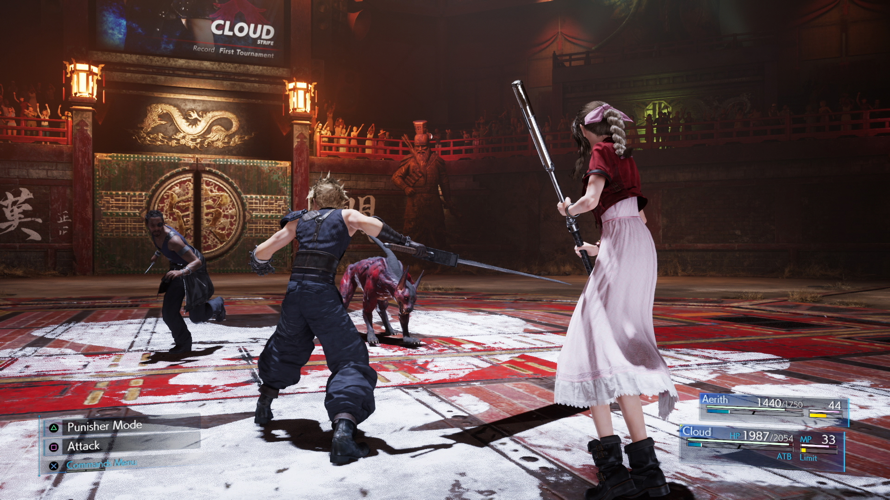
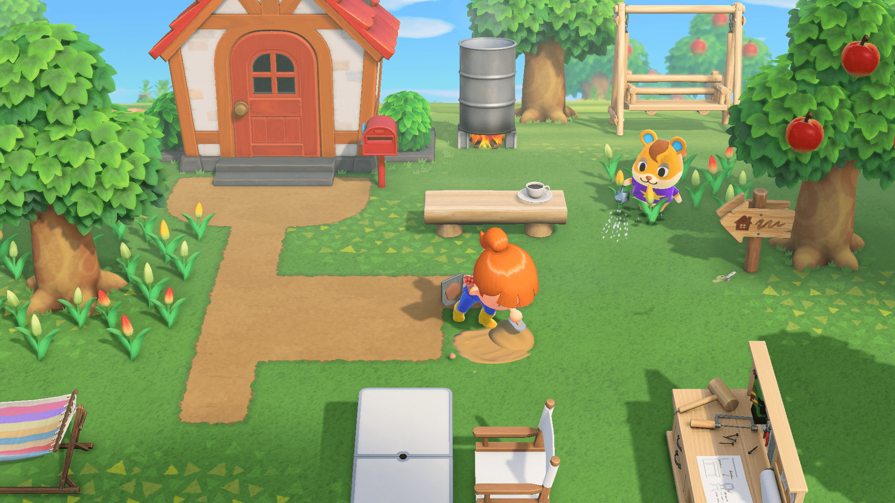
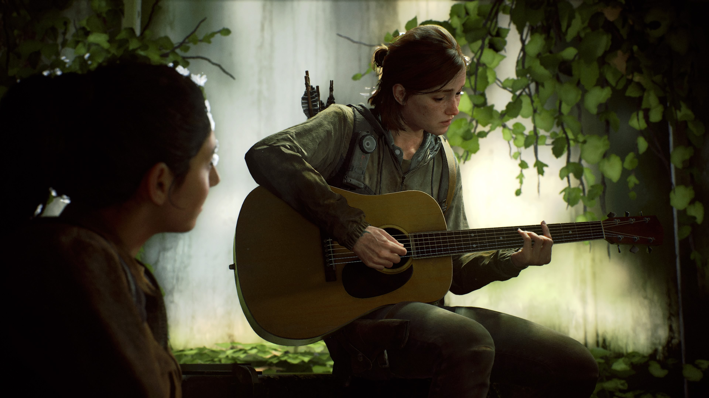
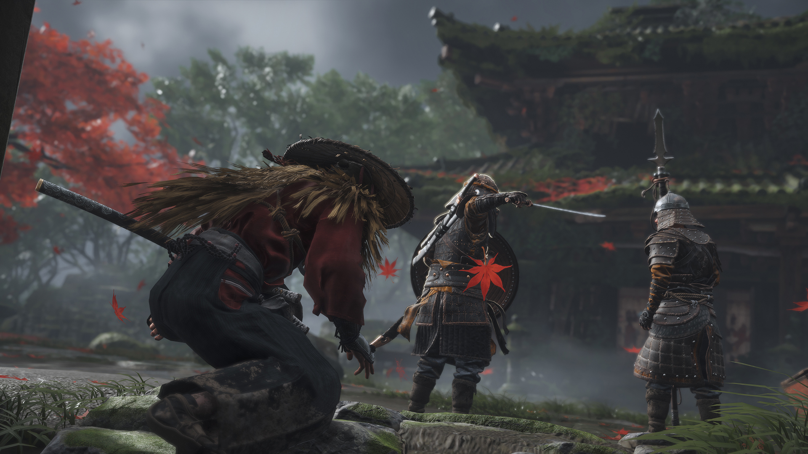
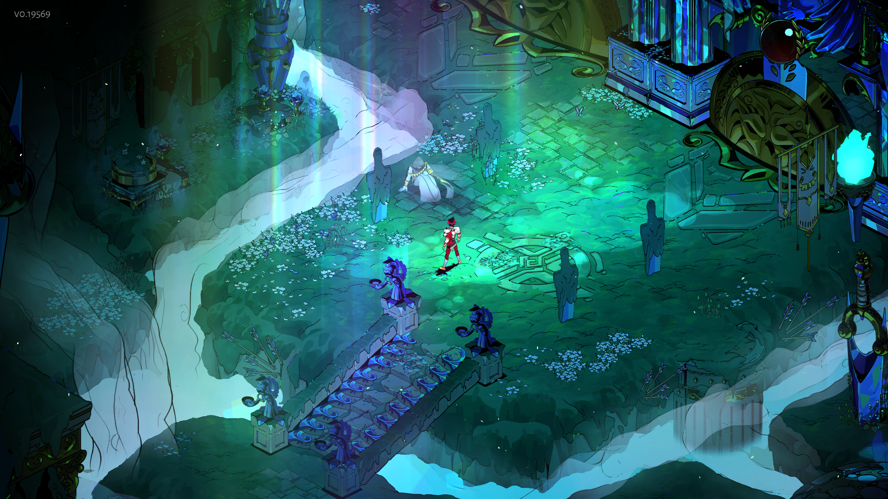

I realized this month that it's over halfway through 2021 and I've been too lazy to write about my favorite games of 2020. Since I'm still feeling lazy I'm going to keep this short, but I figured there's no point in me keeping a list if I'm not going to do anything with it. Here we go.

### 10. Tony Hawk's Pro Skater 1 + 2

The Tony Hawk community really deserved another good game after the disaster of Pro Skater 5. While this is a remaster and I really didn't play too much of it, I really enjoyed my time with it. The graphics are excellent on PC and the skating feels like you remember the old games feeling. I'm glad that someone who gave a shit about this franchise got to work on it and I wish Activision would decide to remaster more of the old games.

### 9. There Is No Game: Wrong Dimension

I found the demo version of this game through a Steam recommendation and I was pleasantly surprised so I decided to purchase the full thing. It grabbed me enough to beat the entire game in just a day or two. The goofy humor really worked for me and the puzzles were pretty inventive and fun. The game uses it's fourth wall breaking theme to great effect in the story, especially towards the end of the game.

### 8. F1 2020

I was fortunate enough to be able to borrow a racing wheel during the pandemic and F1 2020 was by far the most fun I had using it. I love flying around the tracks and using the paddles on the wheel, even at easier difficulties. The campaign mode was especially fun since it gives the player the ability to manage the entire team as well as drive in the races themselves. You can sign drivers, acquire sponsors, decide where to focus development on your car, and do interviews with the media. It's a really fun time for anyone who follows the F1 season all year.

### 7. Final Fantasy VII Remake

I was hot and cold on this game and I took a huge break from it in the middle, because it REALLY does start to drag during the side quests. But I did eventually beat it and overall ended up being pretty positive about it. I do think that the people who will get the most out of this game are those who have played the original. It's great to see these beloved characters in high definition and the writing and interactions between characters is super endearing. I also can't wait to see where the weird meta-narrative goes; I just hope they finish the series in a reasonable amount of time.

### 6. Animal Crossing: New Horizons

Animal Crossing was the game of the pandemic for me and many other people. I've put more hours into it than any other Switch game so far and probably any other game in 2020. I especially enjoyed playing it with my wife and visiting each other's islands as they grew and changed. We ended up buying her a Switch Lite (and eventually a special edition Animal Crossing Switch) because we both needed to have our own copy of the game. It's weird to say, but it really helped regulate my mental health while stuck inside all day when I had relaxed objectives to focus on and work towards. I've completely dropped the game at this point, but it was a lot of fun for a few months.

### 5. Call of Duty: Warzone

I still think that this is the best battle royale that I've played. I didn't think I'd like the simplified gun system at first, but it ended up cutting a lot of unnecessary complexity out of the game. They also pulled in loadouts and killstreaks from Modern Warfare to put a fun Call of Duty spin on the genre. The shooting and gun handling feels great and they seem committed to continually updating the game with new content. 

### 4. Valorant

I've put way too much time into this game and have a love/hate relationship with it as my current competitive game of choice. As someone who tried and failed to get into CSGO, I found Valorant to be much more accessible at the start with the ability system and limited number of maps. It still has the typical problems with toxicity like you find in other competitive games but I have enough friends playing that I can minimize the number of bad teammates I have to deal with. Please don't ask about the amount of money I've spent on gun skins.

### 3. The Last of Us Part II

The story of the Last of Us 2 is going to stick with me for a long time. It was controversial in the gaming community for a few different reasons, but I really enjoyed the direction they took the story after the first game and the new characters that they introduced. It was definitely quite depressing and heavy at times but I never found myself wanting to put the game down. As someone who loved the combat in the original game, this one feels even better with the new combat options and violent character animations. The enemy AI was also some of the most fun that I've experienced with it's ability to react to your character's actions.

### 2. Ghost of Tsushima

I thought I was sick of the Assassin's Creed type of open world games but I guess I'm just a sucker for pretty flowers and cool samurai. The story and quests aren't anything groundbreaking and the combat is pretty typical slash-and-parry fights with a good amount of stealth mixed in. However, they absolutely nailed the environments in this game from the fields of flowing grass and flowers to the sandy, foggy beaches of the coast. The sheer beauty of the game made it fun to spend time exploring. There's also plenty of epic camera shots of samurai duels in even more breathtaking locations. I can't wait to see what this game looks like on the PS5.

### 1. Hades

I was first turned on to Supergiant Games with Bastion and became aware of Hades during it's time in early access. I wasn't considering picking it up immediately since I usually get a limited amount of enjoyment out of roguelike games. Once I did start playing though, I immediately understood why the full release was getting so many good reviews. The controls and combat are top-tier, the different weapons are all fun to use, and the powerups open the way to lots of fun synergies and builds. The story was the aspect of the game that surprised me the most. The dialogue of the characters changes in between runs and you soon realize just how much effort the developers put into reacting to the main character's actions. Having the cross-save capability between Switch and PC was just the cherry on top for me and I'll continue to play this game for a very long time.